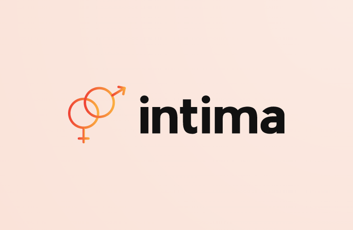

# Intima: Bridging the Gap in Sexual Education

[![Contributors][contributors-shield]][contributors-url]
[![Forks][forks-shield]][forks-url]
[![Stargazers][stars-shield]][stars-url]
[![Issues][issues-shield]][issues-url]
[![MIT License][license-shield]][license-url]
[![LinkedIn][linkedin-shield]][linkedin-url]

<!-- PROJECT LOGO -->
 

  

<h3 align="center">Intima</h3>

  

Bridging the Gap in Sexual Education
     
    <a href="https://www.youtube.com/watch?v=QsxzGdG3how"><strong>Demo Video Link! »</strong></a>
     
     
    <a href="https://devpost.com/software/intima">Devpost Link</a>
    .
    <a href="https://github.com/arncv/Intima/issues">Report Bug</a>
  

## Introduction
Intima is a comprehensive platform designed to address the need for proper sex education in India. The platform aims to tackle the challenges associated with the taboo nature of sexual health discussions by providing accurate and reliable information on safe sex practices, consent, sexually transmitted diseases, and more. With the integration of ChatGPT and an interactive forum, users can access information and seek answers to their questions without fear of judgment or embarrassment.

## Problem
Despite being a natural aspect of life, sex remains a taboo topic in India. The absence of adequate sex education in schools and homes has led to issues such as:
- Polarization between genders
- Objectification of women
- Misunderstanding of sexual health
- Unrealistic expectations about sex
- Misinformation and myths about sex

Young people often resort to unreliable sources like pornography, leading to misconceptions and unhealthy sexual practices. This situation hinders the development of healthy relationships and informed sexual behavior.

## Solution
Intima is an all-in-one platform for sexual education, created to bridge the gap in sex education in India. The platform offers a comprehensive and inclusive space for adolescents and young adults to access accurate information on sex, relationships, and related topics.

Intima covers essential topics such as safe sex practices, contraception, emergency contraception, consent, legal implications of sexual assault, sexually transmitted diseases (STDs), and more. It also provides information on accessing STI testing and treatment services.

In addition to the wealth of information, Intima features an interactive forum where users can ask questions and receive answers from experts in the field. This forum fosters open communication and allows users to seek guidance on sensitive topics.

To further enhance user experience, Intima integrates ChatGPT, an AI-powered chatbot that provides personalized support and answers to questions. Available 24/7, ChatGPT ensures that users have access to reliable information whenever they need it.

## Features
- Comprehensive sexual education platform
- Accurate information on safe sex practices, consent, STDs, and more
- Interactive forum for expert-guided discussions
- Integration of ChatGPT for personalized support and answers
- 24/7 availability for easy access to information

## Make Contribution
[CONTRIBUTING.md](https://github.com/vishal-sharma-369/Intima/blob/main/CONTRIBUTING.md)

## Code Of Conduct

Click Here [CODE_OF_CONDUCT](https://github.com/vishal-sharma-369/Intima/blob/main/CODE_OF_CONDUCT.md)

<!-- LICENSE -->
## License

Distributed under the MIT License. See `LICENSE` for more information.

(<a href="#readme-top">back to top</a>)

## Our ♥️ Contributors

[contributors-shield]: https://img.shields.io/github/contributors/arncv/Intima.svg?style=for-the-badge
[contributors-url]: https://github.com/arncv/Intima/graphs/contributors
[forks-shield]: https://img.shields.io/github/forks/arncv/Intima.svg?style=for-the-badge
[forks-url]: https://github.com/arncv/Intima/network/members
[stars-shield]: https://img.shields.io/github/stars/arncv/Intima.svg?style=for-the-badge
[stars-url]:https://github.com/arncv/Intima/stargazers
[issues-shield]: https://img.shields.io/github/issues/arncv/Intima.svg?style=for-the-badge
[issues-url]: https://github.com/arncv/Intima/issues
[license-shield]: https://img.shields.io/github/license/arncv/Intima.svg?style=for-the-badge
[license-url]: https://github.com/arncv/Intima/blob/master/LICENSE
[linkedin-shield]: https://img.shields.io/badge/-LinkedIn-black.svg?style=for-the-badge&logo=linkedin&colorB=555
[linkedin-url]: https://linkedin.com/in/arnvgl

